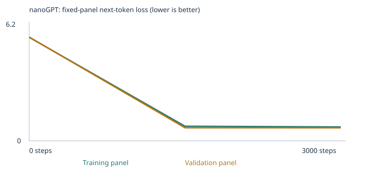

# Custom LLM: nanoGPT trained from scratch (MBA 290T, Assignment 3)

Tomas Diez Canedo · Fork of [pepealonso95/custom-llm](https://github.com/pepealonso95/custom-llm)

## 1. Overview

I trained a tiny word level language model (Karpathy's nanoGPT, about 112 thousand parameters) from random weights on Google Colab's CPU, twice. Experiment 1 used only the classroom corpus. Experiment 2 added my own teaching text for two extension categories, negation and grammar, and trained a fresh model. Both runs were scored on the same 48 fixed evals before and after training. The extended model went from 20/48 to 27/48, and 4 of the 6 extension cases I targeted became correct, while 2 negation cases failed for a reason I can trace back to my own leakage precautions.

**AI disclosure.** I worked with Claude (Anthropic) as a tutor throughout. Claude wrote the corpus generator `make_corpus.py` and the leakage checker `check_corpus.py`, which I reviewed, and drafted this README from my runs and from my own answers during the session. I reviewed every claim and can explain each one. The predictions quoted in section 4 are my own and were written before each run.

## 2. Files and how to run

| What | File |
|---|---|
| Starter experiment, executed | `custom_llm_starter.ipynb` |
| Starter results (run `20260923T021239_085718Z`) | `20260923T021239_085718Z.zip` |
| Extended experiment, executed | `custom_llm_extended.ipynb` |
| Extended results (run `20260923T025343_043830Z`) | `20260923T025343_043830Z.zip` |
| Teaching corpus | `corpus/negation.txt`, `corpus/grammar.txt` |
| Corpus generator and leakage check | `make_corpus.py`, `check_corpus.py` |
| Fixed eval suite and runner (unchanged) | `evals/language_evals.json`, `run_evals.py` |
| Chat interface | notebook section 10, or `chat.py` |

**Run the notebook.** Open `custom_llm.ipynb` in Colab (the default CPU runtime is enough). For the starter run leave `corpus/` empty. For the extended run, run sections 1 and 2 once, upload `negation.txt` and `grammar.txt` into `/content/corpus` from the Files sidebar, then Runtime → Run all. Section 3 should report `Imported files: 2`, with 276 grammar passages and 609 negation passages.

**Rerun evals or chat on a saved model.** Unzip a results ZIP, install `requirements.txt`, then:
```
python run_evals.py --model 20260923T025343_043830Z/model.pt --output results/my-evals
python chat.py --model 20260923T025343_043830Z/model.pt --transcript results/my-chat.json
```

## 3. My three choices

| Setting | Value | Reason |
|---|---|---|
| Corpus | Starter: classroom only. Extended: classroom plus my negation and grammar files | The starter run is the baseline. The extended run changes only the corpus, so any difference in scores can be traced to the added text. |
| Training steps | 3,000, after a 10 step setup check | The brief's starting budget. The setup check ran in 0.42 s, so time was not a constraint. In the starter run the loss was already flat by step 1,500, so more steps would mostly add risk of memorizing. |
| Learning rate | 0.001, with warmup over the first 100 steps and cosine decay to 0.0001 | The recommended default. Too large a step overshoots, so the loss swings or explodes (the notebook stops on a nonfinite loss). Too small a step barely moves the weights, so 3,000 steps would not be enough. Warmup keeps the first noisy updates small; decay allows fine adjustment at the end. |

| Data | Starter | Extended |
|---|---|---|
| Unique passages | 4,592 | 5,477 |
| Train / validation | 4,132 / 460 | 4,929 / 548 |
| Reserved eval passages removed | 160 | 160 |
| Vocabulary | 136 | 284 |
| Unknown token rate (train / held out) | 0.00% / 0.00% | 0.00% / 0.10% |
| Parameters | 111,872 | 121,344 |
| Steps completed / time | 3,000 / 56.11 s | 3,000 / 68.22 s |
| Hardware | Google Colab, CPU, PyTorch 2.11.0+cpu (details in `config.json`) | same |

The vocabulary is built only from training passages, so a word that appears only in validation becomes UNK. Details are in `corpus_manifest.json` and `vocabulary_report.json` inside each ZIP.

## 4. Prediction versus what happened

| Run | My prediction, written before running | What happened |
|---|---|---|
| Setup, 10 steps | "The setup will be very quick and it will not change eval, the only purpose of it is to make sure everything is running smoothly." | Correct. 0.42 s, loss about 4.21, evals 9/48 before and after. |
| Starter, 3,000 steps | "It will work pretty well with the first 24 questions but not that well with the extended categories. From the first 24, somewhere between 21 to 23 correct, and from the others maybe 2 to 6 from simple random chance, so a total of 23 to 29." | 20/48: starter patterns 16/16, new phrasings 4/8, extension 0/24. |
| Extended, 3,000 steps | "I will get the same 20 out of the first 24, and for my added training I expect 5 out of 24, given the two sections account for 6 questions." | 27/48: starter patterns 16/16, new phrasings 7/8, extension 4/24. |

Where I was wrong: I expected a few extension answers right by luck in the starter run, but got zero. None of those 24 cases were even scorable, because their words ("bird", "milk", "cold") are not in the 136 word vocabulary, and unscorable cases count as zero rather than as a random guess. There is no luck without vocabulary. I also underestimated the new phrasing cases: the model passed only 4 of 8 in the starter run, which shows it relies on the exact sentence templates it saw.

## 5. How the model learned (starter run)

**Loss** (fixed panels of 20 training and 20 validation passages, not the full corpus):

| Step | Training | Validation |
|---|---|---|
| 0 | 4.926 | 4.928 |
| 1,500 | 0.682 | 0.718 |
| 3,000 | 0.678 | 0.706 |



The starting loss of 4.93 is what pure guessing looks like: with 136 tokens, a uniform guess gives a loss of ln(136), about 4.91. Loss fell fast and was flat by step 1,500. Training and validation stay close, so there is no sign of memorizing. The straight line from step 0 to 1,500 is drawn, not measured: the panels are only recorded at 0, 1,500 and 3,000. The training log shows a batch loss of 0.76 already at step 500, so the real drop happened much earlier than the picture suggests. Validation shares templates with training, so this does not measure generalization to new kinds of sentences.

**One word traced** (`tokenization.json`, `inspection.json`). The word `customer` is a token. The vocabulary maps it to ID 28, which is just a row number and carries no meaning. Row 28 of the 136 × 64 embedding table holds 64 numbers that the model learns. Coordinate 0 of that vector was −0.057592 at random initialization and 0.036630 after training.

**First update** (coordinate 0 of `customer`, step 1):

| Before | Gradient | Learning rate | After |
|---|---|---|---|
| −0.057592 | +0.000693 | 0.00001 (warmup) | −0.057602 |

The gradient says how the loss changes if this one weight goes up. It is positive, so raising the weight would slightly increase the loss, and the optimizer moved it down. The step is tiny because the learning rate starts near zero during warmup. AdamW scales each step by the gradient's recent size, so the move (about 0.00001) matches the learning rate rather than the raw gradient.

**Next word after "the customer":**
- Before training: customer 1.6%, bus 1.1%, educator 1.0%. Nearly flat, close to 1 in 136.
- After training: reviewed 17.8%, recommended 17.1%, ordered 16.9%, selected 16.3%, compared 16.0%.

The model learned the template "the [customer word] [verb] the [product] after checking the price." Five of its six verbs share almost all the probability.

**Samples** (same generation settings; full files in `samples/` inside each ZIP):
- Untrained: "pear professor bond doctor course harvest team physician journey…" Real words in random order.
- Halfway: "our school has a question about the new educator and lesson ." Already a perfect template sentence.
- Final: "the report about the nurse explains the health in detail ."

What changed is structure: after training every sample is a valid template. What stays unconvincing is meaning. "Explains the health in detail" is grammatical recombination, not understanding.

**Attention.** Attention lets each position pull information from earlier positions; causal masking stops it from seeing later words. In the first head of block 1, for "the customer", the word `customer` puts 0.49 of its attention on the start token, 0.42 on `the` and 0.09 on itself. This is one head in one block, not a full explanation of the model.

**Temperature.** Generation divides the scores by the temperature before turning them into probabilities, so 0.3 concentrates on the likeliest words and 1.2 spreads the choice. My samples at 0.3, 0.8 and 1.2 were nearly identical (`temperature_comparison.json`), because the trained model is very confident in its template continuations. Temperature changes variety only; no weights are updated at generation.

## 6. Evals: four result sets

| Experiment | Stage | All cases | Scorable | Starter patterns | New phrasings | Extension |
|---|---|---|---|---|---|---|
| Starter | Untrained | 9/48 | 24 | 6/16 | 3/8 | 0/24 |
| Starter | Trained | 20/48 | 24 | 16/16 | 4/8 | 0/24 |
| Extended | Untrained | 5/48 | 30 | 3/16 | 1/8 | 1/24 |
| Extended | Trained | 27/48 | 30 | 16/16 | 7/8 | 4/24 |

Per case results, including free continuations, are in `language_evals/untrained/` and `language_evals/final/` inside each ZIP. **Scoring:** each case gives a prompt and four single word choices; the model scores 1 if the correct word gets the highest probability. Ties and cases with unknown words score 0. Only the prompt goes into the model; the answer key is used afterwards.

**Why negation and grammar.** In both, the answer can be worked out from the prompt or from a rule: the negation story states which item was affirmed, and grammar follows agreement and tense. That lets me teach the pattern with different examples and test whether it transfers. Opposites, everyday knowledge and categories can only be passed by teaching the specific fact, which is too close to writing the answer key. Negation also tests attention directly, since the model has to look back at the affirmed item.

**How the files address the gap.** They do two jobs. First, coverage: every word in these six prompts and all their answer choices now appears in the corpus, which raised scorable cases from 24 to 30. Second, patterns: 609 negation stories ("the cup is not green . it is yellow . the cup is yellow .") and 276 grammar sentences, using names, objects and pairings that differ from the tests.

**Extension cases I targeted (extended, trained):**

| Case | Category | Result | Model's probabilities |
|---|---|---|---|
| lang_25, 26, 27 | grammar | 3/3 correct | |
| lang_31 (box) | negation | correct | blue 0.78 |
| lang_32 (Ava) | negation | wrong | picked rice 0.36; answer milk 0.03 |
| lang_33 (door) | negation | wrong | picked wide 0.19; answer closed 0.01 |

The grammar gains reflect both coverage and a learned pattern: for example, "yesterday she" never appears in my files, yet the model picked the past tense. The two negation failures come from my own leakage precautions. To avoid echoing the test stories, the generator never showed "milk" as the item someone bought and never showed "closed" after "not open". The model had never seen those words in the affirmed slot, so it gave them almost no probability. The box case passed because "blue" did appear as the affirmed color in other wordings. Being strict about leakage removed exactly the evidence those two cases needed.

The new phrasing gain (4/8 to 7/8) and the lower untrained score (5/48 against 9/48) cannot be attributed with confidence: the vocabulary and the random starting weights changed, and this is a single run.

**Diagnostic run.** My first extended run scored 25/48 (extension 3/24). Section 3 reported 1,581 negation passages from a 609 line file: the notebook splits text at every period followed by a space, so each story became three separate passages and the model never saw "not green" and "it is yellow" together. I rewrote the stories without a space after inner periods (for example ".it is yellow"), which keeps each story as one passage while the tokenizer still produces the same "." token. The rerun reported 609 passages. The results above are from the fixed run.

## 7. Leakage checks

- Notebook: 160 classroom passages containing eval prompts were removed before splitting (`eval_separation.json`), and both imported files passed the exact prompt check.
- `check_corpus.py` runs the course's own checker plus a stricter check for any run of 5 or more words from a test prompt and its answer. It caught 3 near copies in the first draft (for example "is not open . it is closed ."), which I removed. The official exact match check had passed that draft, which shows why the brief warns that it does not catch paraphrases.

If eval prompts or answers were in the training text, a correct answer would show memory of the exam, not learning. The score would stop measuring anything.

## 8. Chat interface

Run `20260923T021239_085718Z` (starter model), notebook section 10, temperature 0.8, fresh context for each prompt. Transcript: `chat_transcript.json` in that ZIP. Screenshots: [image.png](image.png), [CleanShot 2026-09-22 at 19.36.54@2x.png](CleanShot%202026-09-22%20at%2019.36.54%402x.png).

| Prompt | Reply |
|---|---|
| the customer | selected the item after checking the price . |
| our school | has a question about the local instructor and lesson . |
| the doctor | compared the local dentist with another physician at the new surgeon market has a review of credit and journey helped us understand the care |

The third reply is the failure: it chains three templates without ending the sentence. The model learned which word tends to follow which within its templates, not meaning or sentence boundaries. It continues text; it does not answer questions.

## 9. Limitation and next experiment

**Limitation.** The model copies patterns but does not track who did what. A sample from the extended run reads "ben did not want milk ; he wanted cake . so noah wanted cake ." The affirmed item is right, but the person changed. More broadly, the evals I used to guide my corpus are public, so this is a development benchmark, not a test of unseen generalization.

**Next experiment.** Change one thing: write a small set of new negation tests that never guided my corpus choices, with new names, items and wording, and score the extended model on them. That would show whether the negation pattern generalizes beyond the public benchmark, rather than adding more teaching data aimed at the two cases that failed.
